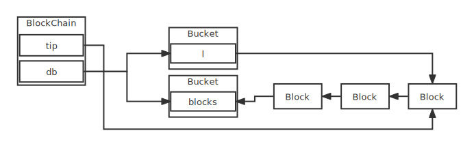

# Block
Block 是基于go实现的一个简易区块链

## Part 1 基本原型
实现了区块链的基本原型，区块及链

## Part 2 工作量证明
Hashcash工作量证明算法,分为以下步骤
- 采取一些公开的数据`data`
- 向其添加一个从0开始的计数器`counter`
- 获取组合(`data+counter`)的`hash`
- 检查`hash`是否满足某些要求
    - 满足，即完成
    - 不满足,增加计数器，并重复步骤3和4

## Part 3 持久化

## Part 4 交易

Transactions:
 - Coinbase 创世块交易，只有输出没有输入
 - UTXOTransaction 点对点的交易, 由一个或多个未使用输出作为输入产生一个或两个输出

Balance:
- UTXO模型
- 余额通过遍历整个交易记录得来